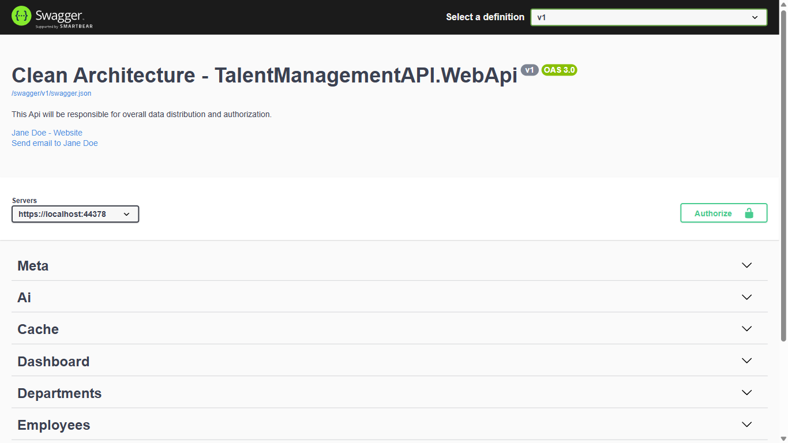
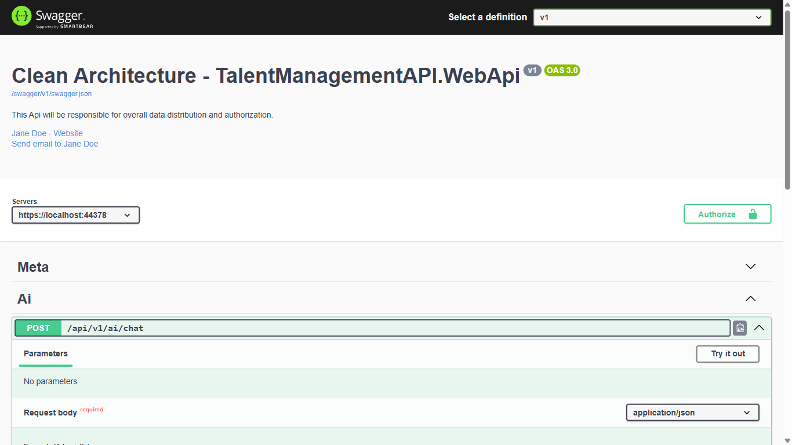

# Run a Local LLM in Your .NET 10 API with Ollama

## How Microsoft.Extensions.AI, OllamaSharp, and a Custom Service Interface Make Your .NET 10 API AI-Ready

Every developer wants AI in their app. The problem is getting started: API keys, cloud costs, rate limits, and the fear of betting your architecture on one vendor. What if you could add a working AI endpoint to your .NET 10 API in under an hour — for free, running entirely on your laptop?

This article shows you exactly how, using [Ollama](https://ollama.com) for a local LLM and [OllamaSharp](https://github.com/awaescher/OllamaSharp) as the .NET client library.

📖 **Tutorial Repository:** [AngularNetTutorial on GitHub](https://github.com/workcontrolgit/AngularNetTutorial)

---

This article is part of the **AngularNetTutorial** series. The full-stack tutorial — covering Angular 20, .NET 10 Web API, and OAuth 2.0 with Duende IdentityServer — has been published at [Building Modern Web Applications with Angular, .NET, and OAuth 2.0](https://medium.com/scrum-and-coke/building-modern-web-applications-with-angular-net-and-oauth-2-0-complete-tutorial-series-7ea97ed3fc56). **This article kicks off Series 6 by adding AI capabilities to the existing TalentManagement API — without breaking any existing functionality for developers who don't have Ollama installed.**

---

## 🎓 What You'll Learn

* **Microsoft.Extensions.AI (MEA)** — The GA abstraction layer shipping with .NET 10 that gives you a single `IChatClient` interface across all AI providers
* **OllamaSharp + MEA** — How OllamaSharp 5.x natively implements `IChatClient`, making Ollama a drop-in MEA provider with no extra package
* **Ollama integration** — Pull a free local model and connect it to your .NET API in minutes
* **Feature flag gating** — Why per-method `IsEnabledAsync` checks return `503` instead of the misleading `404` from `[FeatureGate]`
* **Clean Architecture placement** — Where AI interfaces, implementations, and controllers belong in the layer structure
* **Custom `IAiChatService` interface** — How defining your own service interface in the Application layer hides MEA/OllamaSharp from callers and makes the implementation swappable

---

## 📋 Prerequisites

**Before following this article, you should have:**

* **TalentManagement stack running** — Complete [Series 0–5](https://medium.com/scrum-and-coke/building-modern-web-applications-with-angular-net-and-oauth-2-0-complete-tutorial-series-7ea97ed3fc56) or clone the tutorial repo
* **.NET 10 SDK** — `dotnet --version` should show `10.x`
* **Ollama installed** — Download from [ollama.com](https://ollama.com/download) (free, no account required)
* **llama3.2 model pulled** — `ollama pull llama3.2` (~2 GB download)
* **Basic C# and Clean Architecture familiarity** — Understanding of interfaces, DI, and MediatR helps

**Not set up yet?** Follow the [AngularNetTutorial setup guide](https://github.com/workcontrolgit/AngularNetTutorial) first.

---

## 🎯 The Problem

Adding AI to a production .NET API sounds daunting. Most tutorials show you how to call OpenAI with an API key — which is fine until you hit a rate limit, get an unexpected bill, or need to demo the app offline. Developers following a tutorial shouldn't need a credit card.

Beyond getting started, there's an architectural risk: if your AI code reaches directly into the OpenAI SDK, switching providers later means touching every file that calls it. You've created a tight dependency on one vendor.

**Common pain points:**

* **Vendor lock-in** — Switching from OpenAI to Azure OpenAI (or Ollama) requires rewriting service code
* **Cost barrier** — Cloud LLMs require API keys, rate limits, and billing setup before you can write a single test
* **Feature flag complexity** — Without proper gating, enabling AI affects every user — even those on machines without Ollama installed

---

## 💡 The Solution

**[Microsoft.Extensions.AI](https://learn.microsoft.com/en-us/dotnet/ai/microsoft-extensions-ai)** (MEA) is the standard AI abstraction layer that ships GA with .NET 10. It defines `IChatClient` — a single interface for chat completions that works across OpenAI, Azure OpenAI, Ollama, and any other provider. You code against `IChatClient`; switching providers is a one-line DI change.

**[OllamaSharp](https://github.com/awaescher/OllamaSharp) 5.x** natively implements `IChatClient` from MEA. The former `Microsoft.Extensions.AI.Ollama` provider package has been deprecated — OllamaSharp is now the recommended path. That means you need just two NuGet packages in `Infrastructure.Shared`: `Microsoft.Extensions.AI.Abstractions` for the interface and `OllamaSharp` for the implementation.

[Ollama](https://ollama.com) runs open-weight models like `llama3.2` locally. No API key. No cloud. Works offline. Perfect for tutorials and development.

Provider independence has two layers: MEA's `IChatClient` (standard .NET 10 interface) and our own `IAiChatService` (defined in the Application layer). `OllamaAiService` receives `IChatClient` from DI and wraps it in the Application-layer contract. To swap from Ollama to Azure OpenAI, you register a different `IChatClient` implementation — `OllamaAiService` itself is untouched, and the Application layer, handlers, and controller never change.

We gate AI per-method with `IFeatureManagerSnapshot.IsEnabledAsync("AiEnabled")` rather than a class-level `[FeatureGate]` attribute. The attribute returns `404 Not Found` when disabled — confusing for a known endpoint. The per-method check returns `503 Service Unavailable` with a `detail` message that tells the developer exactly what to enable and where.

**Key benefits:**

* ✅ **Zero cost** — Ollama is free; no API key, no credit card, no rate limits
* ✅ **Standard .NET 10 AI abstraction** — MEA's `IChatClient` is GA and built into the platform; no preview dependencies
* ✅ **Provider swap in one line** — Register a different `IChatClient` to move from Ollama to Azure OpenAI; no service code changes
* ✅ **Safe coexistence** — Feature flag default `false` means original tutorial (Series 0–5) works unchanged
* ✅ **Clean Architecture** — Interface in Application, implementation in Infrastructure.Shared, controller in WebApi

---

## 🚀 How It Works

### Step 1: Install Ollama and Pull a Model

Download Ollama from [ollama.com/download](https://ollama.com/download) for your OS. After installation:

```bash
# Pull the llama3.2 model (~2 GB — fast, capable, great for tutorials)
ollama pull llama3.2

# Start the Ollama server (runs at http://localhost:11434)
ollama serve

# Verify it's running
curl http://localhost:11434/api/tags
```

**What this does:** Ollama downloads model weights and runs a local HTTP server that accepts chat requests. Our .NET API will call this endpoint internally — no external network traffic.

### Step 2: Add NuGet Packages

Add two packages to the Infrastructure.Shared project — the MEA abstraction and the OllamaSharp implementation:

**`TalentManagementAPI.Infrastructure.Shared.csproj`**:

```xml
<PackageReference Include="Microsoft.Extensions.AI.Abstractions" Version="10.3.0" />
<PackageReference Include="OllamaSharp" Version="5.3.4" />
```

**Why both packages?**

`Microsoft.Extensions.AI.Abstractions` ships GA with .NET 10. It defines `IChatClient` — the standard interface for chat completions across all AI providers. Coding against `IChatClient` means your service code never changes when you switch from Ollama to Azure OpenAI or any other provider.

`OllamaSharp` 5.x natively implements `IChatClient`. The former `Microsoft.Extensions.AI.Ollama` provider package has been **deprecated** — OllamaSharp is the recommended path for Ollama integration. This means you do not need a separate adapter package: `OllamaApiClient` from OllamaSharp implements both `IChatClient` (for chat) and `IOllamaApiClient` (for embeddings), and you register it once as a singleton.

**No provider boilerplate in Program.cs.** All AI registration stays inside `AddSharedInfrastructure` — the WebApi project adds zero AI-specific setup.

### Step 3: Add Feature Flag and Ollama Config

In `TalentManagementAPI.WebApi/appsettings.json`, add `AiEnabled` to the existing `FeatureManagement` section and a new `Ollama` section:

```json
"FeatureManagement": {
  "AuthEnabled": true,
  "CacheEnabled": true,
  "AiEnabled": false
},
"Ollama": {
  "BaseUrl": "http://localhost:11434",
  "Model": "llama3.2",
  "EmbeddingModel": "nomic-embed-text",
  "CacheTtlMinutes": 60
}
```

**What each field does:**

* **`BaseUrl`** — where Ollama is listening (`ollama serve` defaults to port 11434)
* **`Model`** — the chat model to use; `llama3.2` is pulled in Step 1
* **`EmbeddingModel`** — used in later articles (6.5+) for semantic search; `nomic-embed-text` is a compact, high-quality embedding model
* **`CacheTtlMinutes`** — how long AI responses are cached in-memory; identical questions within this window return instantly without hitting Ollama again (introduced in the `CachingAiChatService` below)

**Key point:** `"AiEnabled": false` is the default. Developers who haven't installed Ollama can still clone and run the full stack — the AI endpoint simply returns 404. To activate AI features, change this to `true` and ensure Ollama is running.

### Step 4: Define the Application Interface

Create `TalentManagementAPI.Application/Interfaces/IAiChatService.cs`:

```csharp
namespace TalentManagementAPI.Application.Interfaces
{
    public interface IAiChatService
    {
        Task<string> ChatAsync(string message, string? systemPrompt = null,
            CancellationToken cancellationToken = default);
    }
}
```

**Why an interface?** The Application layer defines *what* the service does — not *how*. This follows the Dependency Inversion Principle: high-level modules (Application) don't depend on low-level details (Ollama SDK). Tests can inject a mock `IAiChatService` without needing Ollama running.

### Step 5: Implement in Infrastructure.Shared

Create `TalentManagementAPI.Infrastructure.Shared/Services/OllamaAiService.cs`:

```csharp
#nullable enable
using Microsoft.Extensions.AI;
using TalentManagementAPI.Application.Interfaces;

namespace TalentManagementAPI.Infrastructure.Shared.Services
{
    public class OllamaAiService : IAiChatService
    {
        private readonly IChatClient _chatClient;

        public OllamaAiService(IChatClient chatClient)
        {
            _chatClient = chatClient;
        }

        public async Task<string> ChatAsync(string message, string? systemPrompt = null,
            CancellationToken cancellationToken = default)
        {
            var messages = new List<ChatMessage>();

            if (!string.IsNullOrWhiteSpace(systemPrompt))
                messages.Add(new ChatMessage(Microsoft.Extensions.AI.ChatRole.System, systemPrompt));

            messages.Add(new ChatMessage(Microsoft.Extensions.AI.ChatRole.User, message));

            var response = await _chatClient.GetResponseAsync(messages, cancellationToken: cancellationToken);
            return response.Text ?? string.Empty;
        }
    }
}
```

**What this does:** `OllamaAiService` takes `IChatClient` (the MEA standard interface) from DI — registered in Step 6 as `OllamaApiClient`. It builds a message list, optionally prepending a system prompt that lets callers control the AI's persona or constraints. `GetResponseAsync` is the MEA 10.x API for a single-turn chat completion. `response.Text` returns the assistant's reply as a plain string.

**Why `Microsoft.Extensions.AI.ChatRole.System` instead of just `ChatRole.System`?** Both OllamaSharp and MEA define a `ChatRole` type. Fully qualifying the namespace resolves the ambiguity cleanly without needing a using alias.

### Step 6: Register Services

In `Infrastructure.Shared/ServiceRegistration.cs`, register `OllamaApiClient` as a concrete singleton and expose it as both `IChatClient` and `IOllamaApiClient` — so both interfaces resolve to the same instance:

```csharp
using Microsoft.Extensions.AI;
using TalentManagementAPI.Application.Interfaces;
using TalentManagementAPI.Infrastructure.Shared.Services;

public static void AddSharedInfrastructure(this IServiceCollection services, IConfiguration config)
{
    services.Configure<MailSettings>(config.GetSection("MailSettings"));
    services.AddTransient<IDateTimeService, DateTimeService>();
    services.AddTransient<IEmailService, EmailService>();
    services.AddTransient<IMockService, MockService>();

    // OllamaApiClient implements both IChatClient (Microsoft.Extensions.AI) and IOllamaApiClient.
    // Register as a singleton so both interfaces resolve to the same instance.
    services.AddSingleton<OllamaApiClient>(_ =>
    {
        var baseUrl = config["Ollama:BaseUrl"] ?? "http://localhost:11434";
        var model   = config["Ollama:Model"]   ?? "llama3.2";
        return new OllamaApiClient(new Uri(baseUrl), model);
    });
    services.AddSingleton<IChatClient>(sp => sp.GetRequiredService<OllamaApiClient>());
    services.AddSingleton<IOllamaApiClient>(sp => sp.GetRequiredService<OllamaApiClient>());

    // Metadata scoped per-request so the controller can read cache hit/miss
    services.AddScoped<IAiResponseMetadata, AiResponseMetadata>();

    // Wrap OllamaAiService with a caching decorator — identical questions within
    // CacheTtlMinutes return instantly without hitting Ollama again
    var ttlMinutes = config.GetValue<int>("Ollama:CacheTtlMinutes", 60);
    services.AddTransient<OllamaAiService>();
    services.AddTransient<IAiChatService>(sp => new CachingAiChatService(
        sp.GetRequiredService<OllamaAiService>(),
        sp.GetRequiredService<ICacheProvider>(),
        sp.GetRequiredService<IAiResponseMetadata>(),
        TimeSpan.FromMinutes(ttlMinutes)));
}
```

In `WebApi/Program.cs`, the only AI-related line is the call to `AddSharedInfrastructure` — no extra registration needed:

```csharp
builder.Services.AddApplicationLayer();
builder.Services.AddPersistenceInfrastructure(builder.Configuration);
builder.Services.AddSharedInfrastructure(builder.Configuration);  // ← registers IChatClient + IAiChatService
```

**Why three registrations for one object?** `OllamaApiClient` implements two interfaces from different libraries:

* `IChatClient` (from `Microsoft.Extensions.AI`) — used by `OllamaAiService` for chat completions
* `IOllamaApiClient` (from OllamaSharp) — used by `OllamaEmbeddingService` for embedding generation (introduced in Series 6.5)

Registering the concrete type first as a singleton, then aliasing both interfaces to it, ensures both resolve to the same underlying instance — one HTTP connection, one model selection, shared across the app.

**To swap Ollama for Azure OpenAI in production:** Replace the three `AddSingleton` calls with your Azure OpenAI `IChatClient` registration. `OllamaAiService`, the Application layer, MediatR handlers, and the controller require zero changes.

**What the caching decorator does:** `CachingAiChatService` wraps `OllamaAiService`. On the first call for a given `(message, systemPrompt)` pair, it calls Ollama and stores the reply. On subsequent identical calls within the TTL window, it returns the cached reply — skipping the 1–4 second Ollama inference. The `IAiResponseMetadata` flag tells the controller whether the response was a cache hit, which is surfaced as the `X-AI-Cache: HIT/MISS` response header.

### Step 7: Create the AI Controller

Create `TalentManagementAPI.WebApi/Controllers/v1/AiController.cs`:

```csharp
using Asp.Versioning;
using Microsoft.AspNetCore.Authorization;
using Microsoft.AspNetCore.Mvc;
using TalentManagementAPI.Application.Interfaces;

namespace TalentManagementAPI.WebApi.Controllers.v1
{
    [ApiVersion("1.0")]
    [AllowAnonymous]
    [Route("api/v{version:apiVersion}/ai")]
    public sealed class AiController : BaseApiController
    {
        private readonly IAiChatService _aiChatService;
        private readonly IFeatureManagerSnapshot _featureManager;
        private readonly IAiResponseMetadata _aiMetadata;

        public AiController(
            IAiChatService aiChatService,
            IFeatureManagerSnapshot featureManager,
            IAiResponseMetadata aiMetadata)
        {
            _aiChatService = aiChatService;
            _featureManager = featureManager;
            _aiMetadata = aiMetadata;
        }

        private void SetAiCacheHeader()
            => Response.Headers["X-AI-Cache"] = _aiMetadata.WasCacheHit ? "HIT" : "MISS";

        /// <summary>
        /// Send a message to the AI assistant and receive a reply.
        /// </summary>
        [HttpPost("chat")]
        public async Task<IActionResult> Chat([FromBody] AiChatRequest request,
            CancellationToken cancellationToken)
        {
            if (!await _featureManager.IsEnabledAsync("AiEnabled"))
            {
                return Problem(
                    detail: "AI chat is disabled. Enable FeatureManagement:AiEnabled to use this endpoint.",
                    title: "AI chat is disabled",
                    statusCode: StatusCodes.Status503ServiceUnavailable);
            }

            var reply = await _aiChatService.ChatAsync(
                request.Message, request.SystemPrompt, cancellationToken);
            SetAiCacheHeader();
            return Ok(new AiChatResponse(reply));
        }
    }

    public record AiChatRequest(string Message, string? SystemPrompt = null);
    public record AiChatResponse(string Reply);
}
```

**Why per-method checks instead of `[FeatureGate]` on the class?**

The `[FeatureGate("AiEnabled")]` attribute returns `404 Not Found` when the feature is disabled — a misleading status for a known endpoint. The per-method check returns `503 Service Unavailable` with a clear `detail` message explaining exactly what to enable and where. This is far more helpful to developers hitting the endpoint for the first time.

**`IFeatureManagerSnapshot`** — the snapshot variant reads the feature flags once per request and caches the result for the request lifetime. This avoids multiple config reads per action.

**`IAiResponseMetadata`** — a scoped flag (set by `CachingAiChatService` in Step 6) that records whether the response came from the cache. `SetAiCacheHeader()` surfaces this as `X-AI-Cache: HIT` or `MISS` in every response — visible in the browser Network tab and Swagger, making it easy to see when caching is working.

When `AiEnabled` is `true`, the endpoint is fully active. No other code changes needed.

---

## 💻 Try It Yourself

**Enable AI features** by setting `"AiEnabled": true` in `appsettings.json` and starting Ollama:

```bash
# Terminal 1: Start Ollama (if not already running)
ollama serve

# Terminal 2: Start the .NET API (from the ApiResources submodule)
cd ApiResources/TalentManagement-API
dotnet run
```

Open Swagger at `https://localhost:44378/swagger` and confirm the API is running — you'll see all controller groups listed.



Scroll down to find the **Ai** section and expand it.


Click **POST /api/v1/ai/chat**, then **Try it out**, and send:



Expand **POST /api/v1/ai/chat**, click **Try it out**, and send:

```json
{
  "message": "What is the difference between OAuth 2.0 and OIDC?",
  "systemPrompt": "You are a helpful assistant specializing in identity and security."
}
```

You'll see Ollama's reply in the response body within a few seconds.

**To test without Swagger** — use curl:

```bash
curl -X POST https://localhost:44378/api/v1/ai/chat \
  -H "Content-Type: application/json" \
  -k \
  -d '{"message": "Explain JWT tokens in one paragraph."}'
```

**To verify the feature flag** — set `"AiEnabled": false`, restart the API, and try the same curl. You'll get a `503 Service Unavailable` with a `detail` message explaining exactly what to enable.

---

## 📊 Real-World Impact

**Before this approach:**

* ❌ AI code is tightly coupled to OpenAI SDK — migrating to another provider requires rewriting service code
* ❌ Tutorial readers need an API key and billing account just to run the demo
* ❌ Enabling AI in `develop` branch breaks builds for developers without Ollama

**After this approach:**

* ✅ Swap Ollama for Azure OpenAI in production by writing a new `IAiChatService` implementation and updating one DI registration — Application layer and controller unchanged
* ✅ Zero-cost, zero-signup AI during development — every tutorial reader can follow along
* ✅ Feature flag default `false` means the full Series 0–5 stack runs unchanged — AI is opt-in

---

## 🌟 Why This Matters

**Microsoft.Extensions.AI ships GA with .NET 10** — it is not a preview library. `IChatClient` is the platform-standard interface for chat completions, with first-party support from Microsoft and implementations across OpenAI, Azure OpenAI, Ollama (via OllamaSharp), and more. Building against `IChatClient` means your service layer is future-proof: new providers ship as NuGet packages, and switching is a one-line DI change.

**OllamaSharp 5.x natively implements `IChatClient`.** The former `Microsoft.Extensions.AI.Ollama` adapter package has been deprecated in favor of OllamaSharp directly. That means one fewer dependency and no abstraction-over-an-abstraction: `OllamaApiClient` *is* the `IChatClient` — no adapter wrapper needed.

The custom `IAiChatService` interface adds a second layer of provider independence specific to this application's contract (`ChatAsync` with an optional system prompt). Application-layer code (handlers, queries) and the controller depend only on `IAiChatService` — they are completely unaware of MEA or OllamaSharp. When you are ready to move to a cloud provider, you register a different `IChatClient` (one line in ServiceRegistration.cs) and the rest of the codebase is untouched.

For tutorial purposes, Ollama removes the biggest barrier to learning: access. Every developer on every OS can pull `llama3.2`, type `ollama serve`, and have a working LLM in their local environment. No billing, no configuration, no waiting for API access.

The feature flag pattern ensures this is safe to ship: the codebase always builds, always runs, and the original Series 0–5 experience is completely unchanged. AI features activate on demand.

**Transferable skills:**

* **Microsoft.Extensions.AI** — `IChatClient` is the standard .NET 10 AI interface; the same pattern applies to OpenAI, Azure OpenAI, and any future MEA provider
* **Custom service interface for AI** — The `IAiChatService` pattern applies to any AI provider; define the contract in Application, implement in Infrastructure
* **Per-method feature flag checks** — `IsEnabledAsync` returning `503 Service Unavailable` is more developer-friendly than the `404` from `[FeatureGate]` on a class
* **Clean Architecture for external services** — Interface in Application, implementation in Infrastructure, DI registration in WebApi

---

## 🤝 Community & Support

**Questions or feedback?** The tutorial repository welcomes:

* ⭐ **GitHub stars** — Help others discover it!
* 🐛 **Issue reports** — Found a bug or have a suggestion?
* 💬 **Discussions** — Ask questions, share your use cases
* 🚀 **Pull requests** — Improvements always appreciated

**Found this helpful?** Share it with your team and follow for more full-stack development content!

---

## 📖 Series Navigation

**AngularNetTutorial Blog Series:**

* [Building Modern Web Applications with Angular, .NET, and OAuth 2.0](https://medium.com/scrum-and-coke/building-modern-web-applications-with-angular-net-and-oauth-2-0-complete-tutorial-series-7ea97ed3fc56) — Main tutorial
* [Stop Juggling Multiple Repos: Manage Your Full-Stack App Like a Workspace](../series-0-architecture/0.1-git-submodule-workspace.md) — Git Submodules
* [End-to-End Testing Made Simple: How Playwright Transforms Testing](../series-0-architecture/0.2-playwright-testing.md) — Playwright Overview
* [Speed Up Your Dashboard: Easy Response Caching in .NET 10 With EasyCaching](../series-2-dotnet-api/2.5-dotnet-easycaching.md) — Response Caching (Series 2.5)
* **This Article** — Run a Local LLM in Your .NET 10 API with Ollama (Series 6.1)
* [Build an HR AI Assistant That Knows Your Data](6.2-dotnet-ai-hr-assistant.md) — HR AI Assistant (Series 6.2)
* [Add an AI Chat Widget to Angular with Streaming](6.3-angular-ai-chat-widget.md) — Angular Chat Widget (Series 6.3)

---

**📌 Tags:** #dotnet #csharp #ai #ollama #llm #microsoftextensionsai #cleanarchitecture #aspnetcore #webapi #featureflags #fullstack #angular #oauth2 #locallm #generativeai
