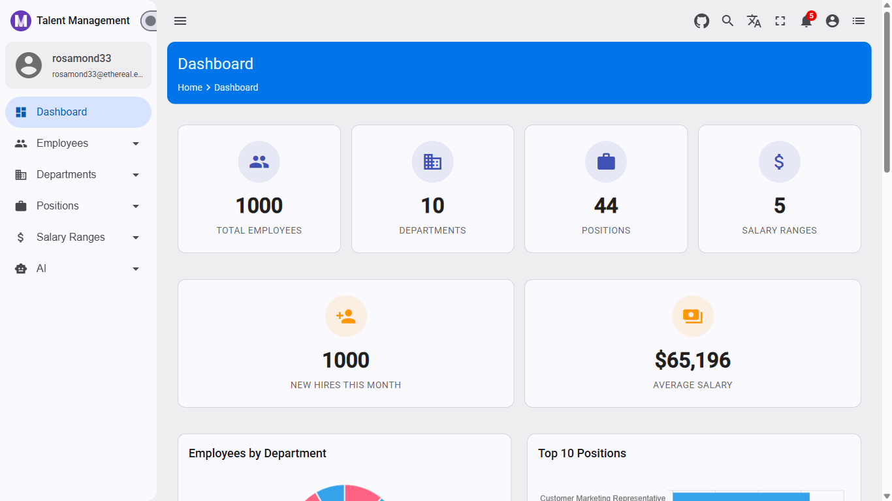

# Build an HR AI Assistant That Knows Your Data

## How to Ground an LLM in Real Workforce Metrics Using MediatR and Clean Architecture

Generic chatbots answer generic questions. What makes an AI assistant useful in a business application is *context* — the ability to answer questions like "Which department has the most headcount?" or "How many new hires joined this month?" by looking at real, live data instead of guessing.

This article shows you how to build a data-aware HR assistant that pulls live workforce metrics from the database, injects them into the LLM prompt, and returns answers grounded in your actual data — not hallucinated statistics.


📖 **Tutorial Repository:** [AngularNetTutorial on GitHub](https://github.com/workcontrolgit/AngularNetTutorial)

---

This article is part of the **AngularNetTutorial** series. The full-stack tutorial — covering Angular 20, .NET 10 Web API, and OAuth 2.0 with Duende IdentityServer — has been published at [Building Modern Web Applications with Angular, .NET, and OAuth 2.0](https://medium.com/scrum-and-coke/building-modern-web-applications-with-angular-net-and-oauth-2-0-complete-tutorial-series-7ea97ed3fc56). **This article builds on [Article 6.1](6.1-dotnet-ai-foundation.md), which established the `IAiChatService` interface, Ollama integration, and feature flag setup. Complete that article before continuing.**

---

## 🎓 What You'll Learn

* **Retrieval-Augmented Generation (RAG) without a vector store** — How to inject structured data directly into a system prompt instead of using embeddings
* **MediatR query for AI** — Creating `GetHrInsightQuery` that fetches live data and builds a context-aware prompt
* **Prompt engineering with real data** — How to format workforce metrics so the LLM answers accurately
* **Clean Architecture placement** — Where the AI query handler belongs in the layer structure
* **`IDashboardMetricsReader` reuse** — How to leverage existing infrastructure without duplicating data access code

---

## 📋 Prerequisites

**Before following this article, you should have:**

* **Article 6.1 complete** — `IAiChatService`, `OllamaAiService`, `AiController`, and `[FeatureGate("AiEnabled")]` all in place
* **Ollama running** — `ollama serve` at `http://localhost:11434` with `llama3.2` pulled
* **`AiEnabled: true`** in `appsettings.json` for local testing
* **TalentManagement data seeded** — Employees, departments, and positions in the database (see Series 5.1)

---

## 🎯 The Problem

The `POST /api/v1/ai/chat` endpoint from Article 6.1 accepts any message and returns a general-purpose LLM reply. Ask it "How many employees are in the Engineering department?" and it will confidently make up a number — because it has no idea what your data looks like.

This is the classic **hallucination problem**: LLMs generate plausible-sounding text based on training data, not your database. For a business application, invented statistics are worse than no answer.

**Two common approaches to grounding an LLM in real data:**

* **Vector embeddings + semantic search (RAG)** — Embed your data into a vector store, retrieve relevant chunks at query time, inject them into the prompt. Powerful, but complex to set up and requires an embedding model.
* **Direct context injection** — Fetch the data you need with a regular database query, format it as text, and include it in the system prompt. Simpler, works for structured/aggregate data.

For HR dashboard metrics — totals, distributions, recent hires — direct context injection is the right choice. The data is small (a few dozen lines of text), always current, and exactly what the LLM needs.



---

## 💡 The Solution

`GetHrInsightQuery` is a MediatR query handler that:

1. Calls `IDashboardMetricsReader.GetDashboardMetricsAsync()` to fetch live workforce data
2. Formats that data into a structured system prompt (the "context window")
3. Calls `IAiChatService.ChatAsync()` with the user's question and the context prompt
4. Returns a `Result<HrInsightDto>` with the answer, original question, and execution time

The LLM receives a system prompt like this:

```
You are an HR data analyst assistant. Answer questions using only the workforce data provided below.

=== CURRENT WORKFORCE DATA ===
Total Employees: 47
Total Departments: 6
Total Positions: 12
New Hires This Month: 3
Average Salary: $72,400.00
Gender Distribution: 29 male, 18 female

Employees by Department:
  - Engineering: 14
  - Marketing: 9
  - Operations: 8
  ...
```

When the user asks "Which department has the most employees?", the LLM reads the injected data and answers correctly: "Engineering, with 14 employees." No hallucination — the answer is in the context.

---

## 🚀 How It Works

### Step 1: Create the DTO

Create `TalentManagementAPI.Application/Features/AI/Queries/GetHrInsight/HrInsightDto.cs`:

```csharp
#nullable enable
namespace TalentManagementAPI.Application.Features.AI.Queries.GetHrInsight
{
    public sealed class HrInsightDto
    {
        public string Question { get; init; } = string.Empty;
        public string Answer { get; init; } = string.Empty;
        public long ExecutionTimeMs { get; init; }
    }
}
```

**Why include `Question` in the response?** The caller gets back the original question alongside the answer — useful for displaying both in the UI (Article 6.4) and for logging/auditing AI interactions.

### Step 2: Create the Query Handler

Create `TalentManagementAPI.Application/Features/AI/Queries/GetHrInsight/GetHrInsightQuery.cs`:

```csharp
#nullable enable
using System.Diagnostics;
using System.Text;
using TalentManagementAPI.Application.Features.Dashboard.Queries.GetDashboardMetrics;
using TalentManagementAPI.Application.Interfaces;

namespace TalentManagementAPI.Application.Features.AI.Queries.GetHrInsight
{
    public sealed class GetHrInsightQuery : IRequest<Result<HrInsightDto>>
    {
        public string Question { get; init; } = string.Empty;

        public sealed class GetHrInsightQueryHandler
            : IRequestHandler<GetHrInsightQuery, Result<HrInsightDto>>
        {
            private readonly IDashboardMetricsReader _metricsReader;
            private readonly IAiChatService _aiChatService;

            public GetHrInsightQueryHandler(
                IDashboardMetricsReader metricsReader,
                IAiChatService aiChatService)
            {
                _metricsReader = metricsReader;
                _aiChatService = aiChatService;
            }

            public async Task<Result<HrInsightDto>> Handle(
                GetHrInsightQuery request,
                CancellationToken cancellationToken)
            {
                var start = Stopwatch.GetTimestamp();

                var metrics = await _metricsReader
                    .GetDashboardMetricsAsync(cancellationToken)
                    .ConfigureAwait(false);

                var systemPrompt = BuildSystemPrompt(metrics);

                var answer = await _aiChatService
                    .ChatAsync(request.Question, systemPrompt, cancellationToken)
                    .ConfigureAwait(false);

                var elapsed = (long)Stopwatch.GetElapsedTime(start).TotalMilliseconds;

                return Result<HrInsightDto>.Success(new HrInsightDto
                {
                    Question = request.Question,
                    Answer = answer,
                    ExecutionTimeMs = elapsed
                });
            }

            private static string BuildSystemPrompt(DashboardMetricsDto metrics)
            {
                var sb = new StringBuilder();
                sb.AppendLine("You are an HR data analyst assistant. Answer questions using only the workforce data provided below. Be concise and factual.");
                sb.AppendLine();
                sb.AppendLine("=== CURRENT WORKFORCE DATA ===");
                sb.AppendLine($"Total Employees: {metrics.TotalEmployees}");
                sb.AppendLine($"Total Departments: {metrics.TotalDepartments}");
                sb.AppendLine($"Total Positions: {metrics.TotalPositions}");
                sb.AppendLine($"Total Salary Ranges: {metrics.TotalSalaryRanges}");
                sb.AppendLine($"New Hires This Month: {metrics.NewHiresThisMonth}");
                sb.AppendLine($"Average Salary: {metrics.AverageSalary:C}");
                sb.AppendLine($"Gender Distribution: {metrics.GenderDistribution.Male} male, {metrics.GenderDistribution.Female} female");
                sb.AppendLine();

                if (metrics.EmployeesByDepartment.Count > 0)
                {
                    sb.AppendLine("Employees by Department:");
                    foreach (var d in metrics.EmployeesByDepartment)
                        sb.AppendLine($"  - {d.DepartmentName}: {d.EmployeeCount}");
                    sb.AppendLine();
                }

                if (metrics.EmployeesByPosition.Count > 0)
                {
                    sb.AppendLine("Employees by Position:");
                    foreach (var p in metrics.EmployeesByPosition)
                        sb.AppendLine($"  - {p.PositionTitle}: {p.EmployeeCount}");
                    sb.AppendLine();
                }

                if (metrics.RecentEmployees.Count > 0)
                {
                    sb.AppendLine("Recent Hires (last 5):");
                    foreach (var e in metrics.RecentEmployees)
                        sb.AppendLine($"  - {e.FullName} ({e.PositionTitle}, {e.DepartmentName}) — hired {e.CreatedAt:yyyy-MM-dd}");
                }

                return sb.ToString();
            }
        }
    }
}
```

**Key design decisions:**

* **`IDashboardMetricsReader` — not `IMediator`** — The handler calls the reader directly instead of dispatching another `GetDashboardMetricsQuery`. This avoids circular MediatR dispatch and keeps the data fetch simple and fast.
* **`StringBuilder` for the prompt** — String concatenation for many lines is inefficient. `StringBuilder` allocates once and appends, which matters when this method runs on every request.
* **`ConfigureAwait(false)`** — Both async calls use `ConfigureAwait(false)` to avoid deadlocks in ASP.NET Core's synchronization context.
* **`Stopwatch.GetTimestamp()` / `GetElapsedTime()`** — High-resolution timer, not `DateTime.UtcNow`. Used to measure total wall-clock time including both the database fetch and the LLM call.

### Step 3: Add the Controller Endpoint

In `TalentManagementAPI.WebApi/Controllers/v1/AiController.cs`, add the `hr-insight` action. This builds on the controller created in Article 6.1 — `_featureManager` (`IFeatureManagerSnapshot`) and `_aiMetadata` (`IAiResponseMetadata`) are already injected in the constructor alongside `IAiChatService`. The `hr-insight` action follows the exact same per-method feature flag pattern as `chat`.

```csharp
using TalentManagementAPI.Application.Features.AI.Queries.GetHrInsight;

// Inside AiController (add after the Chat action):

/// <summary>
/// Ask the HR AI assistant a question about your current workforce data.
/// The assistant fetches live dashboard metrics and injects them into the prompt context.
/// </summary>
[HttpPost("hr-insight")]
public async Task<IActionResult> HrInsight(
    [FromBody] HrInsightRequest request,
    CancellationToken cancellationToken)
{
    if (!await _featureManager.IsEnabledAsync("AiEnabled"))
    {
        return Problem(
            detail: "AI features are disabled. Enable FeatureManagement:AiEnabled to use this endpoint.",
            title: "AI is disabled",
            statusCode: StatusCodes.Status503ServiceUnavailable);
    }

    var result = await Mediator.Send(
        new GetHrInsightQuery { Question = request.Question },
        cancellationToken);

    SetAiCacheHeader();
    return Ok(result);
}

// At the bottom of the file, alongside AiChatRequest:
public record HrInsightRequest(string Question);
```

**Why use `Mediator.Send()` here but not in the handler?** The controller dispatches to MediatR (the pipeline entry point), which handles validation behaviors, logging, and other cross-cutting concerns. The handler calls the reader directly because it's already inside the pipeline — dispatching again would add unnecessary overhead.

**No new DI registration needed.** MediatR scans the Application assembly and registers all `IRequestHandler<,>` implementations automatically (see `ServiceExtensions.cs`). `GetHrInsightQueryHandler` is picked up without any extra configuration.

---

## 💻 Try It Yourself

**Enable AI features** and start your stack:

```bash
# Terminal 1: Ollama
ollama serve

# Terminal 2: .NET API (with AiEnabled: true in appsettings.json)
cd ApiResources/TalentManagement-API/TalentManagementAPI.WebApi
dotnet run
```

Open Swagger at `https://localhost:44378/swagger` and find **POST /api/v1/ai/hr-insight**.


Try these questions:

```json
{ "question": "Which department has the most employees?" }
```

```json
{ "question": "How many new hires joined this month?" }
```

```json
{ "question": "What is the gender distribution across the company?" }
```

```json
{ "question": "Who are the most recent hires and what positions do they hold?" }
```

**Expected response shape:**

```json
{
  "succeeded": true,
  "data": {
    "question": "Which department has the most employees?",
    "answer": "Engineering has the most employees with 14 staff members.",
    "executionTimeMs": 2341
  }
}
```


**To test the feature flag** — set `"AiEnabled": false` in `appsettings.json` and restart the API. Both `/ai/chat` and `/ai/hr-insight` return `503 Service Unavailable`. No other endpoints are affected.

---

## 📊 What Changes Between Requests

Every call to `POST /api/v1/ai/hr-insight`:

1. **Fetches fresh metrics** from the database via `IDashboardMetricsReader`
2. **Builds a new system prompt** with the current data
3. **Sends to Ollama** — the LLM sees your live workforce numbers

If you add 10 new employees and ask "How many employees do we have?", the answer reflects the current count — not a cached snapshot from startup.

**Performance note:** Each request makes two I/O calls — one database query and one Ollama inference. The database query is fast (milliseconds). Ollama inference with `llama3.2` typically takes 1–4 seconds on a modern laptop. Article 6.6 will add caching for repeated identical questions.

---

## 📐 Where This Fits in Clean Architecture

```
Application/
└── Features/
    └── AI/
        └── Queries/
            └── GetHrInsight/
                ├── GetHrInsightQuery.cs     ← Handler lives here
                └── HrInsightDto.cs          ← Response shape

WebApi/
└── Controllers/v1/
    └── AiController.cs                      ← New hr-insight endpoint
```

**Why `Features/AI/` and not `Features/Dashboard/`?** The query belongs to the AI feature, not the dashboard feature. It *uses* dashboard data, but its responsibility is answering HR questions — a distinct concern. Mixing it into the dashboard feature would blur the boundary and make the code harder to navigate as AI features grow.

**Dependencies flow inward:**

* `AiController` → `GetHrInsightQuery` (Application)
* `GetHrInsightQueryHandler` → `IDashboardMetricsReader` (Application interface)
* `GetHrInsightQueryHandler` → `IAiChatService` (Application interface)
* `DashboardMetricsReader` implements `IDashboardMetricsReader` (Infrastructure.Persistence)
* `OllamaAiService` implements `IAiChatService` (Infrastructure.Shared)

The handler never references `OllamaAiService` or `DashboardMetricsReader` directly — only the interfaces. This is the Dependency Inversion Principle in action: swap the database or the LLM provider without touching the query handler.

---

## 📊 Real-World Impact

**Before this approach:**

* ❌ LLM answers HR questions with invented statistics — no connection to real data
* ❌ Analysts must export data, format it manually, and paste into ChatGPT
* ❌ Every AI question requires a separate data-fetch step outside the application

**After this approach:**

* ✅ LLM answers grounded in live workforce data — no hallucination for covered metrics
* ✅ Single endpoint: ask a question, get a data-backed answer
* ✅ No new infrastructure — reuses `IDashboardMetricsReader` already in production

---

## 🌟 Why This Matters

This pattern — "fetch data, inject into prompt, ask LLM" — is the foundation of practical AI in business applications. Vector databases and embeddings get more attention, but for structured aggregate data (counts, averages, distributions), direct context injection is simpler, faster to implement, and easier to debug.

The LLM becomes a natural language interface to your existing data. HR managers who can't write SQL can ask plain-English questions and get accurate answers from a system that knows your actual workforce.

**Transferable skills:**

* **Prompt construction patterns** — Format any structured data into LLM context using the same `StringBuilder` technique
* **MediatR + AI** — The `GetHrInsightQuery` pattern extends to any domain: sales metrics, inventory, customer data
* **Grounding vs. hallucination** — Understanding *when* to inject context vs. when to let the LLM use general knowledge

---

## 🤝 Community & Support

**Questions or feedback?** The tutorial repository welcomes:

* ⭐ **GitHub stars** — Help others discover it!
* 🐛 **Issue reports** — Found a bug or have a suggestion?
* 💬 **Discussions** — Ask questions, share your use cases
* 🚀 **Pull requests** — Improvements always appreciated

---

## 📖 Series Navigation

**AngularNetTutorial Blog Series:**

* [Building Modern Web Applications with Angular, .NET, and OAuth 2.0](https://medium.com/scrum-and-coke/building-modern-web-applications-with-angular-net-and-oauth-2-0-complete-tutorial-series-7ea97ed3fc56) — Main tutorial
* [Run a Local LLM in Your .NET 10 API with Ollama](6.1-dotnet-ai-foundation.md) — AI Foundation (Series 6.1)
* **This Article** — Build an HR AI Assistant That Knows Your Data (Series 6.2)
* [Add an AI Chat Widget to Angular with Streaming](6.3-angular-ai-chat-widget.md) — Angular Chat Widget (Series 6.3)
* [AI-Generated Dashboard Insights in Angular Material](6.4-angular-ai-dashboard-insights.md) — Dashboard Insights (Series 6.4)

---

**📌 Tags:** #dotnet #csharp #ai #ollama #llm #rag #promptengineering #cleanarchitecture #mediatr #aspnetcore #webapi #hrtech #fullstack #angular #generativeai #locallm
