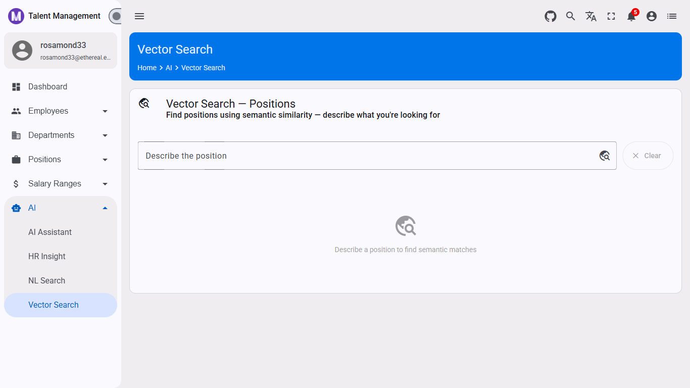

# Semantic Position Search with Vector Embeddings in Angular Material

## How to Find Positions by Meaning, Not Just Keywords

Keyword search fails for positions. A user who types *"cloud infrastructure role"* will miss positions titled *"DevOps Engineer"* or *"Platform SRE"* — even if those roles are exactly what they're looking for. This article adds a dedicated **Vector Search** page to the TalentManagement app — a semantic search that finds positions by *meaning*, not exact text match.



📖 **Tutorial Repository:** [AngularNetTutorial on GitHub](https://github.com/workcontrolgit/AngularNetTutorial)

---

This article is part of the **AngularNetTutorial** series. The full-stack tutorial — covering Angular 20, .NET 10 Web API, and OAuth 2.0 with Duende IdentityServer — has been published at [Building Modern Web Applications with Angular, .NET, and OAuth 2.0](https://medium.com/scrum-and-coke/building-modern-web-applications-with-angular-net-and-oauth-2-0-complete-tutorial-series-7ea97ed3fc56). **This article builds on Article 6.3 (AI Submenu). The `AiService` and the `ai/vector-search` route scaffold created there are used here.**

---

> **⚠️ Skeleton Article:** The .NET backend for semantic search (vector embeddings, `POST /api/v1/positions/semantic-search`) is not yet documented. This article covers the Angular component fully. The backend article will be published separately.

---

## 🎓 What You'll Learn

* **Semantic search vs. keyword search** — Why vector similarity finds conceptually related results that exact-match search misses
* **Match score display** — How to show a percentage similarity badge (`score` from 0.0 to 1.0) in an Angular Material table
* **`debounceTime` + `switchMap`** — The same RxJS pattern from Article 6.4, applied to vector search
* **`SemanticPositionResult` interface** — The typed contract between the Angular component and the vector search endpoint
* **Navigation from search to detail** — How to navigate to an existing position detail page from the search results

---

## 📋 Prerequisites

**Before following this article, you should have:**

* **Article 6.1 complete** — AI foundation in place
* **Article 6.3 complete** — AI submenu, `AiService` with `semanticPositionSearch()` method, `ai-vector-search` component scaffolded
* **`VectorSearchEnabled: true`** in the API's `appsettings.json` (separate from `AiEnabled`)
* **Vector embeddings seeded** — The API must have position descriptions embedded in the vector store

> **Note:** Vector search requires additional backend setup (embedding model, vector store). See the .NET vector search article when published.

---

## 🎯 What We're Building


A dedicated **Vector Search** page at `/ai/vector-search`:

* A single text input — describe the position you're looking for in natural language
* **600ms debounce** — identical pattern to NL Search (Article 6.4)
* The query goes to `POST /api/v1/positions/semantic-search` — returns up to 10 positions ranked by semantic similarity
* A **match score badge** shows each result's similarity percentage (green badge, e.g. `87%`)
* Results display in a Material table with position number, title, department, salary range, and a view link

**How vector search works:**

1. The user's query text is embedded into a vector (a list of numbers representing meaning)
2. The API compares that vector against pre-computed embeddings for all position descriptions
3. Positions with similar meanings (not just matching words) are returned, ranked by cosine similarity
4. The `score` field (0.0–1.0) represents how semantically close each position is to the query

---

## 🚀 Implementation

### Step 1: `semanticPositionSearch` in `AiService`

If you followed Article 6.3, `ai.service.ts` already includes this method and the `SemanticPositionResult` interface. For reference:

```typescript
export interface SemanticPositionResult {
  id: string;
  positionNumber: string;
  positionTitle: string;
  positionDescription: string;
  departmentName: string;
  salaryRangeName: string;
  score: number;
  executionTimeMs: number;
}

// In the AiService class:
semanticPositionSearch(queryText: string, topK = 10): Observable<SemanticPositionResult[]> {
  return this.http.post<SemanticPositionResult[]>(
    `${this.apiUrl}/positions/semantic-search`,
    { queryText, topK }
  );
}
```

**Why `topK = 10`?** The default returns the 10 most similar positions. Semantic search does not have a concept of "no results" — it always returns the closest matches. Limiting to 10 shows meaningful results without overwhelming the user with low-confidence matches.

---

### Step 2: Build `AiVectorSearchComponent`

**`src/app/routes/ai/ai-vector-search/ai-vector-search.component.ts`:**

```typescript
import { Component, OnDestroy, inject } from '@angular/core';
import { CommonModule } from '@angular/common';
import { FormsModule } from '@angular/forms';
import { Router } from '@angular/router';
import { MatCardModule } from '@angular/material/card';
import { MatIconModule } from '@angular/material/icon';
import { MatButtonModule } from '@angular/material/button';
import { MatInputModule } from '@angular/material/input';
import { MatFormFieldModule } from '@angular/material/form-field';
import { MatProgressSpinnerModule } from '@angular/material/progress-spinner';
import { MatTableModule } from '@angular/material/table';
import { MatTooltipModule } from '@angular/material/tooltip';
import { MatChipsModule } from '@angular/material/chips';
import { Subject, of } from 'rxjs';
import { debounceTime, switchMap, catchError, takeUntil } from 'rxjs/operators';
import { PageHeader } from '@shared';
import { AiService, SemanticPositionResult } from '../../../services/api/ai.service';
import { environment } from '../../../../environments/environment';

@Component({
  selector: 'app-ai-vector-search',
  standalone: true,
  templateUrl: './ai-vector-search.component.html',
  styleUrl: './ai-vector-search.component.scss',
  imports: [
    CommonModule, FormsModule, MatCardModule, MatIconModule, MatButtonModule,
    MatInputModule, MatFormFieldModule, MatProgressSpinnerModule,
    MatTableModule, MatTooltipModule, MatChipsModule, PageHeader,
  ],
})
export class AiVectorSearchComponent implements OnDestroy {
  private aiService = inject(AiService);
  private router = inject(Router);
  private destroy$ = new Subject<void>();
  private searchSubject = new Subject<string>();

  aiEnabled = environment.aiEnabled;
  query = '';
  loading = false;
  error = '';
  results: SemanticPositionResult[] = [];
  displayedColumns = ['score', 'positionNumber', 'positionTitle', 'departmentName', 'salaryRangeName', 'actions'];

  constructor() {
    this.searchSubject
      .pipe(
        debounceTime(600),
        switchMap(q => {
          if (!q.trim()) { this.results = []; return of(null); }
          this.loading = true;
          this.error = '';
          return this.aiService.semanticPositionSearch(q).pipe(
            catchError(err => {
              this.error = err?.error?.detail
                ?? 'Failed to search. Is the API running with VectorSearchEnabled: true?';
              this.loading = false;
              return of(null);
            })
          );
        }),
        takeUntil(this.destroy$)
      )
      .subscribe(results => {
        if (results === null) { this.loading = false; return; }
        this.results = results;
        this.loading = false;
      });
  }

  onQueryChange(): void { this.searchSubject.next(this.query); }

  clear(): void { this.query = ''; this.results = []; this.error = ''; }

  viewPosition(id: string): void { this.router.navigate(['/positions', id]); }

  scorePercent(score: number): string { return `${Math.round(score * 100)}%`; }

  ngOnDestroy(): void { this.destroy$.next(); this.destroy$.complete(); }
}
```

**Key design decisions:**

* **`of(null)` on empty query** — Clears the results and returns an immediately-completing observable when the input is empty. `switchMap` needs an observable — returning `null` directly would throw.

* **`scorePercent()` helper** — Converts the raw float (e.g. `0.87`) to a display string (`87%`). Keeping this logic in the component (not the template) makes it testable.

* **Single-step search** — Unlike NL Search (Article 6.4), vector search is a single API call. There is no second structured API call — the backend returns the already-resolved position records alongside the scores.

* **`MatChipsModule`** in imports — Included for potential score badge styling via chip-like appearance. Used in the SCSS `.score-badge` class.

---

### Step 3: Template — `ai-vector-search.component.html`

```html
<page-header />

<!-- AI Disabled Banner -->
<div *ngIf="!aiEnabled" class="ai-disabled-banner">
  <mat-card class="disabled-card">
    <mat-card-content>
      <div class="disabled-content">
        <mat-icon>info</mat-icon>
        <div>
          <strong>AI features are disabled.</strong>
          <p>
            Set <code>aiEnabled: true</code> in <code>environment.ts</code> and
            <code>"VectorSearchEnabled": true</code> in the API's <code>appsettings.json</code>.
          </p>
        </div>
      </div>
    </mat-card-content>
  </mat-card>
</div>

<div *ngIf="aiEnabled">
  <mat-card class="search-card">
    <mat-card-header>
      <mat-icon mat-card-avatar>travel_explore</mat-icon>
      <mat-card-title>Vector Search — Positions</mat-card-title>
      <mat-card-subtitle>Find positions using semantic similarity</mat-card-subtitle>
    </mat-card-header>
    <mat-card-content>

      <div class="search-row">
        <mat-form-field appearance="outline" class="search-input">
          <mat-label>Describe the position</mat-label>
          <input matInput [(ngModel)]="query" (ngModelChange)="onQueryChange()"
            placeholder="e.g. senior software engineer with cloud experience"
            [disabled]="loading" />
          <mat-icon matSuffix>travel_explore</mat-icon>
        </mat-form-field>
        <button mat-stroked-button (click)="clear()" [disabled]="!query && results.length === 0">
          <mat-icon>clear</mat-icon> Clear
        </button>
      </div>

      <div class="loading-row" *ngIf="loading">
        <mat-spinner diameter="24"></mat-spinner>
        <span>Searching with vector similarity…</span>
      </div>
      <div class="error-row" *ngIf="error">
        <mat-icon>error_outline</mat-icon>
        <span>{{ error }}</span>
      </div>

      <div class="table-container" *ngIf="!loading && results.length > 0">
        <table mat-table [dataSource]="results" class="results-table">
          <ng-container matColumnDef="score">
            <th mat-header-cell *matHeaderCellDef>Match</th>
            <td mat-cell *matCellDef="let pos">
              <span class="score-badge">{{ scorePercent(pos.score) }}</span>
            </td>
          </ng-container>
          <ng-container matColumnDef="positionNumber">
            <th mat-header-cell *matHeaderCellDef>Position #</th>
            <td mat-cell *matCellDef="let pos">{{ pos.positionNumber }}</td>
          </ng-container>
          <ng-container matColumnDef="positionTitle">
            <th mat-header-cell *matHeaderCellDef>Title</th>
            <td mat-cell *matCellDef="let pos">{{ pos.positionTitle }}</td>
          </ng-container>
          <ng-container matColumnDef="departmentName">
            <th mat-header-cell *matHeaderCellDef>Department</th>
            <td mat-cell *matCellDef="let pos">{{ pos.departmentName }}</td>
          </ng-container>
          <ng-container matColumnDef="salaryRangeName">
            <th mat-header-cell *matHeaderCellDef>Salary Range</th>
            <td mat-cell *matCellDef="let pos">{{ pos.salaryRangeName }}</td>
          </ng-container>
          <ng-container matColumnDef="actions">
            <th mat-header-cell *matHeaderCellDef>Actions</th>
            <td mat-cell *matCellDef="let pos">
              <button mat-icon-button color="primary"
                (click)="viewPosition(pos.id)" matTooltip="View Position">
                <mat-icon>visibility</mat-icon>
              </button>
            </td>
          </ng-container>
          <tr mat-header-row *matHeaderRowDef="displayedColumns"></tr>
          <tr mat-row *matRowDef="let row; columns: displayedColumns;"></tr>
        </table>
        <p class="result-count">{{ results.length }} result(s) found</p>
      </div>

      <div class="empty-state" *ngIf="!loading && !error && query && results.length === 0">
        <mat-icon>work_off</mat-icon>
        <p>No positions matched your query</p>
      </div>
      <div class="empty-state" *ngIf="!loading && !error && !query">
        <mat-icon>travel_explore</mat-icon>
        <p>Describe a position to find semantic matches</p>
      </div>

    </mat-card-content>
  </mat-card>
</div>
```

---

## 💻 Try It Yourself

**Prerequisites:** Vector embeddings must be seeded in the API. See the .NET vector search article.

Navigate to `http://localhost:4200/ai/vector-search`.


**Try these queries:**

```
senior cloud infrastructure engineer
```

```
HR specialist with recruiting experience
```

```
data analyst with SQL and Python skills
```

**What to observe:**

* Results are ranked by the `Match` badge (highest similarity first)
* Positions with different titles but similar meanings appear (e.g., querying *"cloud engineer"* may surface *"DevOps Engineer"* and *"Platform Engineer"*)
* The score drops for results that are less conceptually similar

---

## 📐 Where This Fits in the Architecture

```
src/app/
├── routes/ai/
│   └── ai-vector-search/
│       ├── ai-vector-search.component.ts    ← search pipeline (debounce → vector call)
│       ├── ai-vector-search.component.html  ← search input, score badges, results table
│       └── ai-vector-search.component.scss  ← score-badge styles
├── services/api/
│   └── ai.service.ts    ← semanticPositionSearch() — calls POST /positions/semantic-search
└── app.routes.ts        ← { path: 'vector-search', component: AiVectorSearchComponent }
                            registered under the 'ai' children block
```

---

## 📊 Real-World Impact

**Before this article:**

* ❌ Position search only matches on exact title or position number keywords
* ❌ Users must know the exact job title to find it
* ❌ Synonyms and related concepts are invisible to the search

**After this article:**

* ✅ Search by description: *"leadership role in engineering"* finds relevant positions
* ✅ Match score shows confidence — users can set their own threshold
* ✅ The position list component is unchanged — vector search is a separate AI-powered page
* ✅ Backend-agnostic — swap the vector store (Qdrant, pgvector, Azure AI Search) without touching Angular

---

## 🤝 Community & Support

**Questions or feedback?** The tutorial repository welcomes:

* ⭐ **GitHub stars** — Help others discover it!
* 🐛 **Issue reports** — Found a bug or have a suggestion?
* 💬 **Discussions** — Ask questions, share your use cases
* 🚀 **Pull requests** — Improvements always appreciated

---

## 📖 Series Navigation

**AngularNetTutorial Blog Series:**

* [Building Modern Web Applications with Angular, .NET, and OAuth 2.0](https://medium.com/scrum-and-coke/building-modern-web-applications-with-angular-net-and-oauth-2-0-complete-tutorial-series-7ea97ed3fc56) — Main tutorial
* [Run a Local LLM in Your .NET 10 API with Ollama](6.1-dotnet-ai-foundation.md) — AI Foundation (Series 6.1)
* [Build an HR AI Assistant That Knows Your Data](6.2-dotnet-ai-hr-assistant.md) — HR AI Assistant (Series 6.2)
* [Build a Dedicated AI Section in Angular with Submenu Navigation](6.3-angular-ai-chat-widget.md) — AI Submenu (Series 6.3)
* [Natural Language Employee Search in Angular Material](6.4-angular-ai-nl-search.md) — NL Search (Series 6.4)
* **This Article** — Semantic Position Search with Vector Embeddings (Series 6.6)

---

**📌 Tags:** #angular #angularmaterial #typescript #ai #vectorsearch #embeddings #semanticsearch #rxjs #switchmap #hrtech #standalone #cleanarchitecture #aspnetcore #dotnet #fullstack #generativeai #locallm
