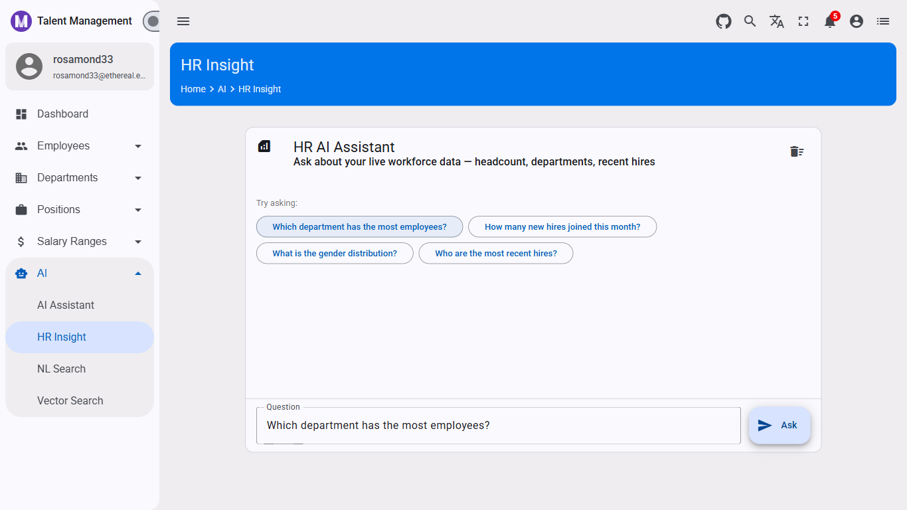
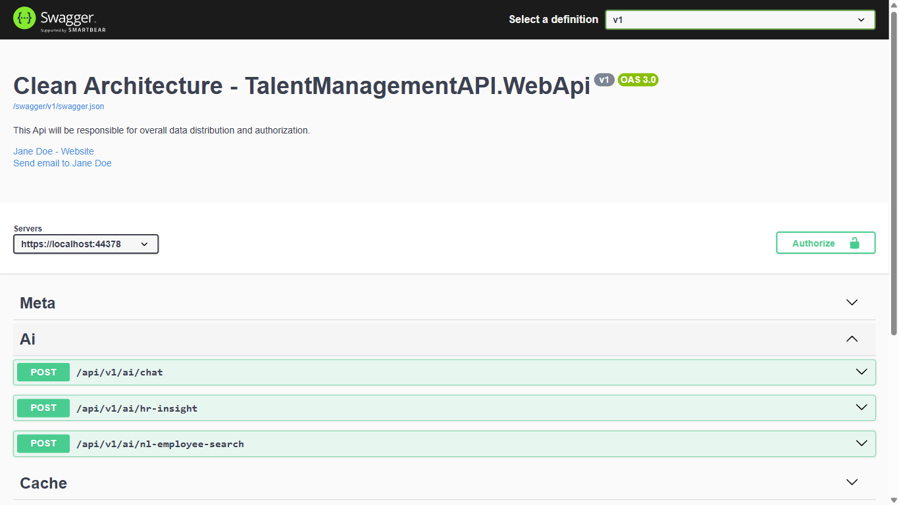

# Cache Your AI Responses: Save Time and API Costs

## How to Add a Cache-Aside Layer to Your .NET LLM Service Without Changing a Single Caller

Every call to `ChatAsync` hits Ollama, waits for inference, and returns a reply. For a local model that takes 2–5 seconds per response, this is noticeable. For a cloud model billed per token, it adds up fast.

But many AI queries in a business app are **repetitive**. HR managers ask the same workforce questions. The natural language search bar sees the same queries. The dashboard insight is re-fetched on every page load.

The fix is a **cache-aside decorator** — a wrapper around `IAiChatService` that checks the cache first, returns instantly on a hit, and only calls Ollama on a miss. No changes to any handler, controller, or query class. The callers don't know the cache exists.

This article shows you how to build that decorator using the EasyCaching infrastructure already in the TalentManagement API, and how to expose cache status to API consumers via an `X-AI-Cache: HIT/MISS` response header.



📖 **Tutorial Repository:** [AngularNetTutorial on GitHub](https://github.com/workcontrolgit/AngularNetTutorial)

---

This article is part of the **AngularNetTutorial** series. **This article builds on Article 6.1 (AI Foundation). The `IAiChatService`, `OllamaAiService`, and EasyCaching infrastructure created in earlier articles are reused here.**

---

## 🎓 What You'll Learn

* **Decorator pattern for services** — wrap an existing service implementation with new behavior without touching callers
* **Cache-aside with EasyCaching** — check cache → return on hit → call service on miss → store result
* **SHA256 cache keys** — deterministic, compact keys derived from the full prompt, collision-resistant
* **Scoped metadata services** — carry information (cache hit status) from a service layer call to a controller response without coupling layers
* **`X-AI-Cache` response header** — let API consumers, developers, and monitoring tools see exactly which responses came from cache

---

## 📋 Prerequisites

**Before following this article, you should have:**

* **Article 6.1 complete** — `IAiChatService`, `OllamaAiService`, `AiController`, and EasyCaching infrastructure all in place
* **EasyCaching already installed** — `EasyCaching.Core` and `EasyCaching.InMemory` are already in `TalentManagementAPI.WebApi.csproj`
* **`CacheEnabled: true`** in `appsettings.json` for local testing (the existing `CachingOptions.Enabled` flag)

---

## 🎯 What We're Building

A **caching decorator** for `IAiChatService`:

* Every `ChatAsync` call produces a **SHA256 cache key** from the system prompt + user message
* On **cache hit** — return the stored reply immediately (no Ollama call), set `X-AI-Cache: HIT`
* On **cache miss** — call `OllamaAiService.ChatAsync`, store the reply, set `X-AI-Cache: MISS`
* TTL is configurable via `Ollama:CacheTtlMinutes` in `appsettings.json` (default: 60 minutes)
* Zero changes to `GetHrInsightQuery`, `NlSearchQueryHandler`, or any existing handler — they all call `IAiChatService` and keep working unchanged

**Why a decorator and not a pipeline behavior?**

A MediatR pipeline behavior would only cache at the query level — you'd need one behavior per query type. A decorator on `IAiChatService` caches at the infrastructure level: every caller, every query, every endpoint, all in one place. Add it once, it covers the entire AI surface.

**Why SHA256 for the cache key?**

System prompts in this app can be hundreds of characters long. Using the raw prompt as a cache key is wasteful and fragile. SHA256 produces a compact 64-character hex string from any input, is deterministic (same inputs always produce the same key), and has no practical collisions.

---

## 🚀 Implementation

### Step 1: Add `CacheTtlMinutes` to appsettings.json

Open `TalentManagementAPI.WebApi/appsettings.json` and add `CacheTtlMinutes` to the existing `Ollama` section:

```json
"Ollama": {
  "BaseUrl": "http://localhost:11434",
  "Model": "llama3.2",
  "CacheTtlMinutes": 60
}
```

This controls how long an AI response stays cached. 60 minutes works well for:
* Dashboard insights — workforce data doesn't change by the minute
* HR questions — same question asked repeatedly during a session
* NL search — common queries like "find all engineers" resolve identically every time

Set it lower (e.g., `5`) during development to test both HIT and MISS paths easily.

---

### Step 2: Create the Response Metadata Interface

Create `TalentManagementAPI.Application/Interfaces/IAiResponseMetadata.cs`:

```csharp
namespace TalentManagementAPI.Application.Interfaces
{
    /// <summary>
    /// Scoped service that carries AI response metadata (e.g., cache hit status)
    /// from the service layer to the controller within a single request.
    /// </summary>
    public interface IAiResponseMetadata
    {
        bool WasCacheHit { get; set; }
    }
}
```

This is a **scoped service** — one instance per HTTP request. The caching decorator writes `WasCacheHit = true/false`. The controller reads it and adds the `X-AI-Cache` header. No HTTP concerns bleed into the service layer.

---

### Step 3: Create the Caching Decorator

Create `TalentManagementAPI.Infrastructure.Shared/Services/CachingAiChatService.cs`:

```csharp
#nullable enable
using System.Security.Cryptography;
using System.Text;
using TalentManagementAPI.Application.Interfaces;
using TalentManagementAPI.Application.Interfaces.Caching;

namespace TalentManagementAPI.Infrastructure.Shared.Services
{
    /// <summary>
    /// Decorator for IAiChatService that adds cache-aside behaviour.
    /// Checks the cache first; on a miss, delegates to the inner service and stores the result.
    /// Sets IAiResponseMetadata.WasCacheHit so controllers can emit X-AI-Cache headers.
    /// </summary>
    public sealed class CachingAiChatService : IAiChatService
    {
        private readonly IAiChatService _inner;
        private readonly ICacheProvider _cache;
        private readonly IAiResponseMetadata _metadata;
        private readonly TimeSpan _ttl;

        public CachingAiChatService(
            IAiChatService inner,
            ICacheProvider cache,
            IAiResponseMetadata metadata,
            TimeSpan ttl)
        {
            _inner = inner;
            _cache = cache;
            _metadata = metadata;
            _ttl = ttl;
        }

        public async Task<string> ChatAsync(
            string message,
            string? systemPrompt = null,
            CancellationToken cancellationToken = default)
        {
            var cacheKey = BuildCacheKey(message, systemPrompt);

            var cached = await _cache.GetAsync<string>(cacheKey, cancellationToken).ConfigureAwait(false);
            if (cached is not null)
            {
                _metadata.WasCacheHit = true;
                return cached;
            }

            var reply = await _inner.ChatAsync(message, systemPrompt, cancellationToken).ConfigureAwait(false);

            if (!string.IsNullOrEmpty(reply))
            {
                await _cache.SetAsync(
                    cacheKey,
                    reply,
                    new CacheEntryOptions(_ttl),
                    cancellationToken).ConfigureAwait(false);
            }

            _metadata.WasCacheHit = false;
            return reply;
        }

        /// <summary>
        /// Builds a deterministic 64-char hex cache key from the prompt inputs.
        /// SHA256 keeps keys compact regardless of how long the system prompt is.
        /// </summary>
        private static string BuildCacheKey(string message, string? systemPrompt)
        {
            var raw = $"{systemPrompt ?? string.Empty}|{message}";
            var hash = SHA256.HashData(Encoding.UTF8.GetBytes(raw));
            return $"ai:chat:{Convert.ToHexString(hash).ToLowerInvariant()}";
        }
    }
}
```

**Key design decisions:**

* **`_inner` is `IAiChatService`** — the decorator depends on the interface, not `OllamaAiService` directly. You could stack another decorator on top (e.g., a logging decorator) without changing this class.

* **`cached is not null` check** — `ICacheProvider.GetAsync<string>` returns `null` on a miss. An empty string `""` would be a valid (if unusual) cached reply, so we check for null specifically.

* **Guard: `!string.IsNullOrEmpty(reply)`** — we don't cache empty responses. If Ollama returned nothing (service glitch, model timeout), we don't want to permanently cache an empty string.

* **`_ttl` passed at construction** — keeps this class free of `IConfiguration` dependencies. The registration code (next step) reads the TTL from config and passes the resolved `TimeSpan`.

---

### Step 4: Register the Decorator and Metadata Service

Open `TalentManagementAPI.Infrastructure.Shared/ServiceRegistration.cs` and update the AI service registrations:

```csharp
services.AddScoped<IAiResponseMetadata, AiResponseMetadata>();

var ttlMinutes = config.GetValue<int>("Ollama:CacheTtlMinutes", 60);
var ttl = TimeSpan.FromMinutes(ttlMinutes);

services.AddTransient<OllamaAiService>();
services.AddTransient<IAiChatService>(sp => new CachingAiChatService(
    sp.GetRequiredService<OllamaAiService>(),
    sp.GetRequiredService<ICacheProvider>(),
    sp.GetRequiredService<IAiResponseMetadata>(),
    ttl));
```

Also add the concrete `AiResponseMetadata` implementation in the same file (or a separate small file):

```csharp
internal sealed class AiResponseMetadata : IAiResponseMetadata
{
    public bool WasCacheHit { get; set; }
}
```

**Why `AddTransient<OllamaAiService>()` and `AddTransient<IAiChatService>(...)`?**

We need the DI container to resolve `OllamaAiService` by its concrete type (not by `IAiChatService`) so the decorator can wrap it. Registering `OllamaAiService` directly by its concrete type enables `sp.GetRequiredService<OllamaAiService>()` in the factory. If we only registered it as `IAiChatService`, `GetRequiredService<OllamaAiService>()` would throw.

---

### Step 5: Add `X-AI-Cache` Header to AiController

Open `TalentManagementAPI.WebApi/Controllers/v1/AiController.cs` and inject `IAiResponseMetadata`:

```csharp
private readonly IAiChatService _aiChatService;
private readonly IFeatureManagerSnapshot _featureManager;
private readonly IAiResponseMetadata _aiMetadata;

public AiController(
    IAiChatService aiChatService,
    IFeatureManagerSnapshot featureManager,
    IAiResponseMetadata aiMetadata)
{
    _aiChatService = aiChatService;
    _featureManager = featureManager;
    _aiMetadata = aiMetadata;
}
```

Add a private helper to set the header after any AI endpoint call:

```csharp
private void SetAiCacheHeader()
{
    Response.Headers["X-AI-Cache"] = _aiMetadata.WasCacheHit ? "HIT" : "MISS";
}
```

Call it in each endpoint after the AI response:

```csharp
// In Chat():
var reply = await _aiChatService.ChatAsync(request.Message, request.SystemPrompt, cancellationToken);
SetAiCacheHeader();
return Ok(new AiChatResponse(reply));

// In HrInsight():
var result = await Mediator.Send(new GetHrInsightQuery { Question = request.Question }, cancellationToken);
SetAiCacheHeader();
return Ok(result);

// In NlEmployeeSearch():
var result = await Mediator.Send(new NlSearchQuery { Query = request.Query }, cancellationToken);
SetAiCacheHeader();
return result.IsSuccess
    ? Ok(result.Value)
    : BadRequest(new { detail = result.Errors.FirstOrDefault() });
```

---

## 💻 Try It Yourself

**Configure:**

```json
// appsettings.json
"Ollama": {
  "BaseUrl": "http://localhost:11434",
  "Model": "llama3.2",
  "CacheTtlMinutes": 5
},
"FeatureManagement": {
  "AiEnabled": true,
  "CacheEnabled": true
}
```

**Start the stack and verify via Swagger:**

Navigate to `https://localhost:44378/swagger` → `POST /api/v1/ai/chat`.



```json
{ "message": "What is Clean Architecture?" }
```

**First call (MISS):**
* Takes 2–4 seconds
* Response header: `X-AI-Cache: MISS`

**Second call (same body):**
* Returns in < 50ms
* Response header: `X-AI-Cache: HIT`

**Test with `CacheEnabled: false`:**

```json
"FeatureManagement": {
  "AiEnabled": true,
  "CacheEnabled": false
}
```

All calls return `X-AI-Cache: MISS` — the `EasyCachingProviderAdapter.IsCacheEnabled()` guard returns `false`, `GetAsync` always returns null, and the decorator always calls through to Ollama.

**Test TTL expiry:**

Set `CacheTtlMinutes: 1`, make a call, wait 90 seconds, call again. The second call returns `X-AI-Cache: MISS` and takes the full inference time again.

---

## 📐 What Changed in the Architecture

```
Application/Interfaces/
└── IAiResponseMetadata.cs            ← new: carries cache hit status per request

Infrastructure.Shared/Services/
├── OllamaAiService.cs                ← unchanged
└── CachingAiChatService.cs           ← new: cache-aside decorator

Infrastructure.Shared/
└── ServiceRegistration.cs            ← updated: register decorator + metadata

WebApi/Controllers/v1/
└── AiController.cs                   ← updated: inject metadata, add X-AI-Cache header

WebApi/
└── appsettings.json                  ← updated: +CacheTtlMinutes
```

**No changes to:**

* `GetHrInsightQuery` — still calls `IAiChatService` unchanged
* `NlSearchQueryHandler` — still calls `IAiChatService` unchanged
* `EmployeesController` — untouched
* Any Domain or Infrastructure.Persistence code

---

## 📊 Real-World Impact

**Before this article:**

* ❌ Every AI call goes to Ollama regardless of whether the same question was asked 30 seconds ago
* ❌ Dashboard insight re-fetches on every page load (same prompt every time)
* ❌ No visibility into which responses came from cache vs inference

**After this article:**

* ✅ Repeated queries return instantly — `X-AI-Cache: HIT` in < 50ms
* ✅ First-call latency (MISS) is unchanged — no overhead added to the inference path
* ✅ `CacheEnabled: false` disables caching globally without touching service code
* ✅ TTL configurable per environment — short for dev, longer for production
* ✅ Cache header visible in Swagger, browser DevTools, and any API monitoring tool

---

## 🌟 Why the Decorator Pattern Scales

The decorator approach applies to any cross-cutting concern you want to add to a service:

**Other decorators you could stack on `IAiChatService`:**

* **Logging decorator** — log every prompt and response with timing
* **Rate-limiting decorator** — reject calls above N per minute per user
* **Sanitization decorator** — strip PII from prompts before sending to the LLM
* **Fallback decorator** — try a backup model if the primary fails

Each decorator wraps the previous one. The controller always calls `IAiChatService`. Registration order controls the wrapping order. No handler, query, or controller changes — ever.

---

## 🤝 Community & Support

**Questions or feedback?** The tutorial repository welcomes:

* ⭐ **GitHub stars** — Help others discover it!
* 🐛 **Issue reports** — Found a bug or have a suggestion?
* 💬 **Discussions** — Ask questions, share your use cases
* 🚀 **Pull requests** — Improvements always appreciated

---

## 📖 Series Navigation

**AngularNetTutorial Blog Series:**

* [Building Modern Web Applications with Angular, .NET, and OAuth 2.0](https://medium.com/scrum-and-coke/building-modern-web-applications-with-angular-net-and-oauth-2-0-complete-tutorial-series-7ea97ed3fc56) — Main tutorial
* [Run a Local LLM in Your .NET 10 API with Ollama](6.1-dotnet-ai-foundation.md) — AI Foundation (Series 6.1)
* [Build an HR AI Assistant That Knows Your Data](6.2-dotnet-ai-hr-assistant.md) — HR AI Assistant (Series 6.2)
* [Add an AI Chat Widget to Angular with Material Design](6.3-angular-ai-chat-widget.md) — AI Chat Widget (Series 6.3)
* [AI-Generated Dashboard Insights in Angular Material](6.4-angular-ai-dashboard-insights.md) — Dashboard Insights (Series 6.4)
* [Natural Language Employee Search with LLM Query Parsing](6.5-dotnet-natural-language-search.md) — NL Search (Series 6.5)
* **This Article** — Cache Your AI Responses (Series 6.6)
* [Semantic Employee Search with MSSQL 2025 Native Vector Search](6.7-dotnet-mssql-vector-search.md) — Vector Search (Series 6.7)

---

**📌 Tags:** #dotnet #csharp #ai #ollama #llm #caching #easycaching #designpatterns #decorator #cleanarchitecture #performance #webapi #aspnetcore #locallm #generativeai
